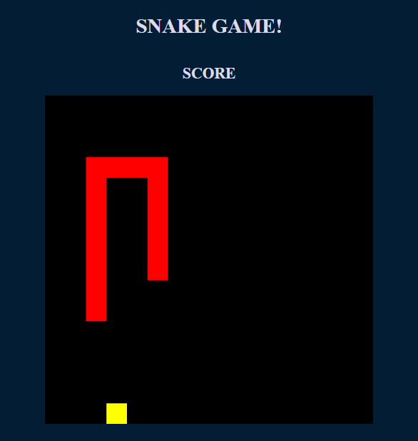

## Snake game project

This repository is part of the challenge presented by <a href="https://www.linkedin.com/school/digitalinnovation-one/">Digital Innovation One</a> and <a href="https://www.linkedin.com/in/gabrielapinheiro129/">Gabriela Pinheiro.</a>
 The project is the last part of the HTML Web Developer Bootcamp.

So far, this is how the project looks like the figure below:

 Regarding to JavaScript, it shows how creative we can be with simple functions, conditions, directions and positions. Obviously, we can always do better, that's why I am willing to keep working on this soon. I intend to look for improvemnts about extra aspects such as score, highscore, speed, colours.

